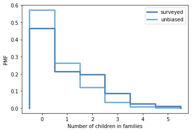

[Think Stats Chapter 3 Exercise 1](http://greenteapress.com/thinkstats2/html/thinkstats2004.html#toc31) (actual vs. biased)

*Exercise: Something like the class size paradox appears if you survey children and ask how many children are in their family. Families with many children are more likely to appear in your sample, and families with no children have no chance to be in the sample.*

*Use the NSFG respondent variable numkdhh to construct the actual distribution for the number of children under 18 in the respondents' households.*

*Now compute the biased distribution we would see if we surveyed the children and asked them how many children under 18 (including themselves) are in their household.*

*Plot the actual and biased distributions, and compute their means.*

resp = nsfg.ReadFemResp()

childpmf = thinkstats2.Pmf(resp.numkdhh, label='surveyed')

print('Mean of household children from survey: ' + str(childpmf.Mean()))

Mean of household children from survey: 1.024205155043831

childestpmf = UnbiasPmf(childpmf, label='unbiased')

print('Estimated unbiased mean: ' + str(childestpmf.Mean()))

Estimated unbiased mean: 0.6542235905329998

